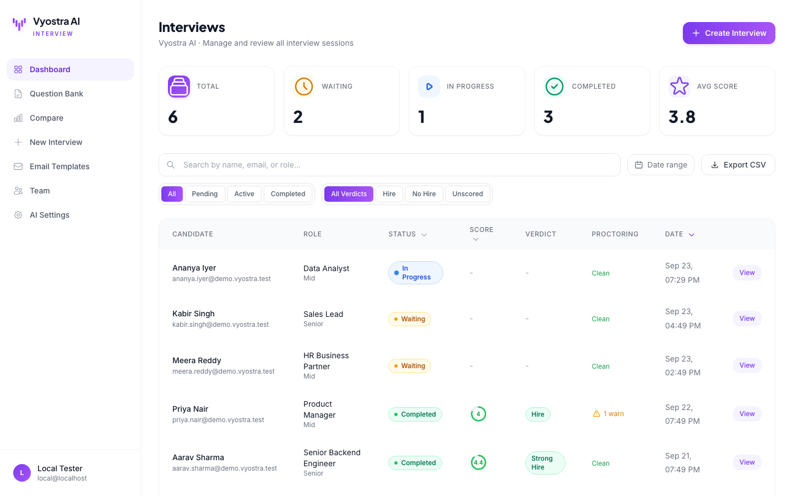
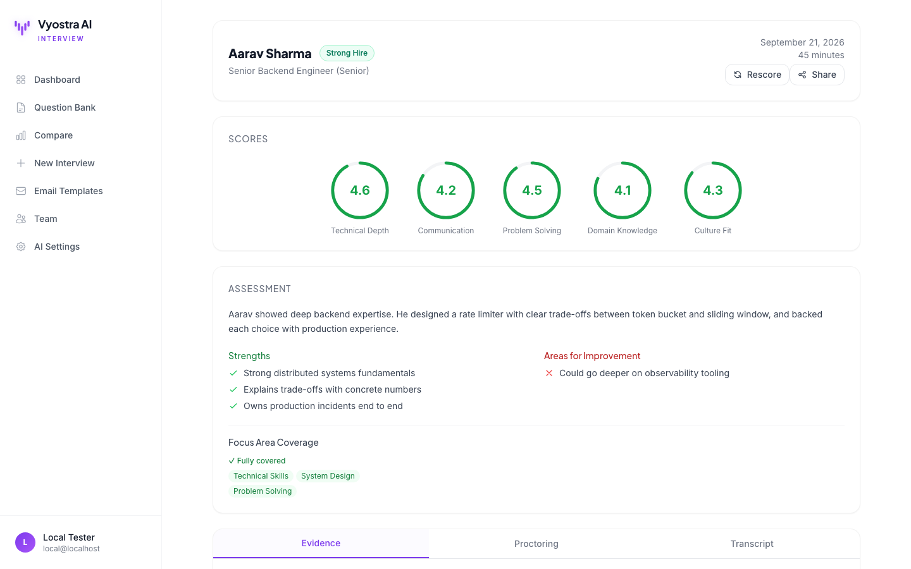
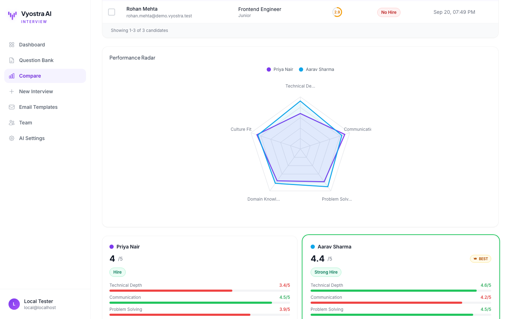
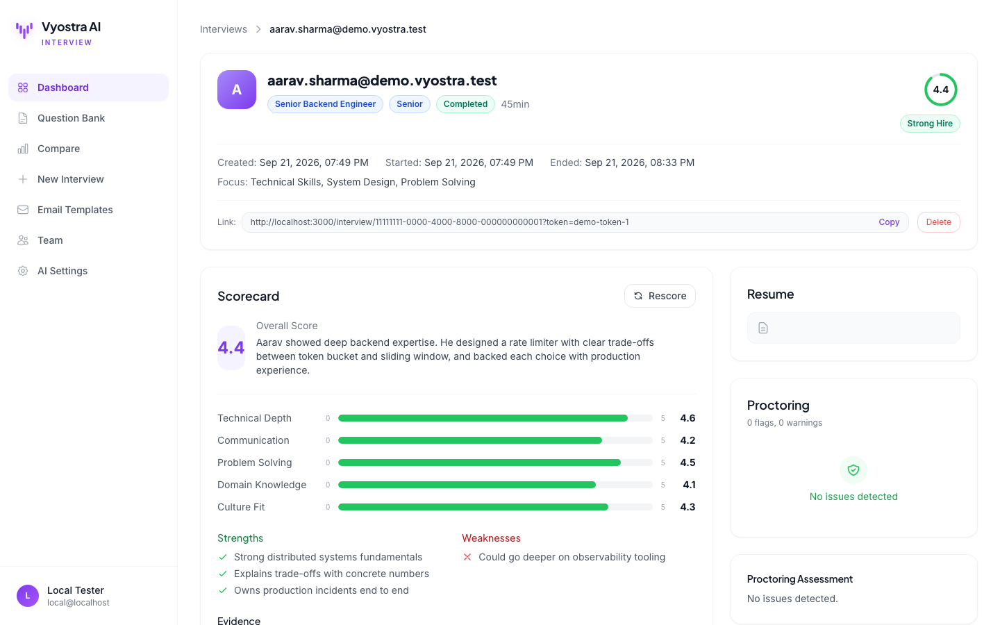
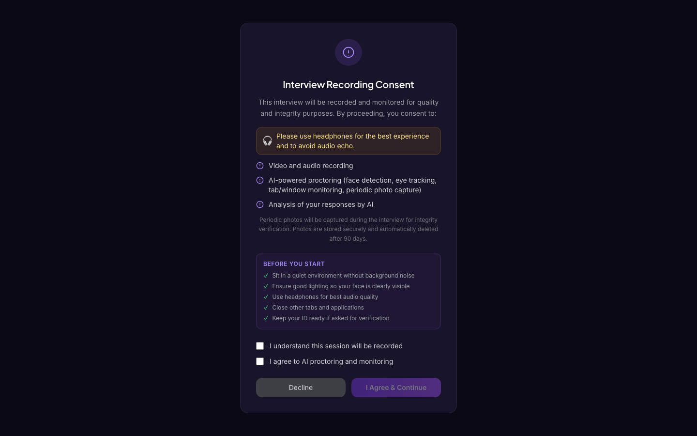
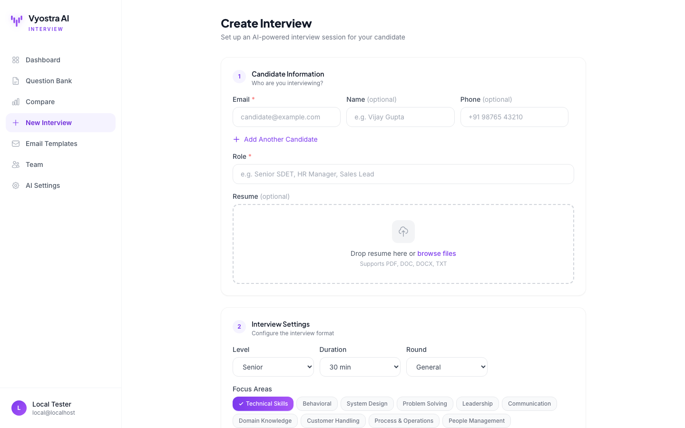
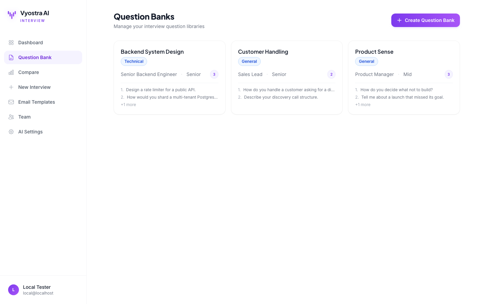
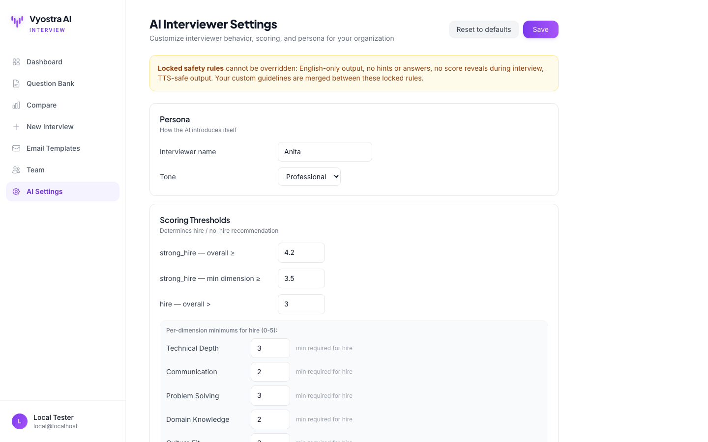

<p align="center">
  
</p>

<h1 align="center">Vyostra AI Interview</h1>

<p align="center">
  <b>AI voice &amp; video interviews with real-time proctoring and evidence-based scoring.</b><br />
  <sub>Part of the <b>Vyostra AI</b> platform: AI agents built for Indian businesses.</sub>
</p>

<p align="center">
  
</p>

<p align="center">
  <a href="#quick-start">Quick Start</a> &nbsp;&middot;&nbsp;
  <a href="#screenshots">Screenshots</a> &nbsp;&middot;&nbsp;
  <a href="#features-at-a-glance">Features</a> &nbsp;&middot;&nbsp;
  <a href="#how-it-works">How It Works</a> &nbsp;&middot;&nbsp;
  <a href="#pages">Pages</a> &nbsp;&middot;&nbsp;
  <a href="#api-reference">API Reference</a>
</p>

<p align="center">
  <a href="https://github.com/akvinayaktiwari/VyostraAI-Interview/actions/workflows/ci.yml"></a>
  
  
  
  
  
  
</p>

---

## How It Works

<p align="center">
  
</p>

---

## Screenshots

<p align="center">
  
  <br /><sub><b>Dashboard</b>: every interview with live status, AI score, verdict and proctoring at a glance</sub>
</p>

<table>
<tr>
<td width="50%"><br /><sub><b>Scorecard</b>: five scored dimensions, assessment, strengths and focus-area coverage</sub></td>
<td width="50%"><br /><sub><b>Compare</b>: side-by-side radar chart and per-dimension scores</sub></td>
</tr>
<tr>
<td width="50%"><br /><sub><b>Interview detail</b>: timeline, shareable candidate link, scorecard and proctoring report</sub></td>
<td width="50%"><br /><sub><b>Candidate room</b>: consent and pre-interview checks before the AI interview starts</sub></td>
</tr>
<tr>
<td width="50%"><br /><sub><b>Create interview</b>: candidate, resume, level, duration and focus areas</sub></td>
<td width="50%"><br /><sub><b>Question banks</b>: reusable question sets per role and round</sub></td>
</tr>
<tr>
<td colspan="2"><br /><sub><b>AI settings</b> (admin): interviewer persona, hiring thresholds and topics to avoid</sub></td>
</tr>
</table>

<sub>Screenshots use fictional demo data.</sub>

---

## Features at a Glance

<table>
<tr>
<td width="50%">

### Voice Interview Engine
- AI conducts natural voice conversations
- Deepgram Nova-2 STT (real-time, Indian English)
- Deepgram Aura TTS (primary) + Edge TTS (free fallback)
- Domain-aware: Tech, HR, Sales, Ops, CX, PM, Design, Data, Finance
- Level-calibrated: Intern to Director
- Time-aware pacing (adapts to interview duration)
- Custom question banks
- Resume-based follow-ups

</td>
<td width="50%">

### Proctoring & Integrity
- Face detection (Chrome API + canvas fallback)
- Eye tracking (gaze direction)
- Window/app switch detection (3 methods: blur + visibility + focus poll)
- Phone/device detection (bright object analysis)
- Mandatory screen sharing + fullscreen enforcement
- Periodic photo capture (every 60s)
- Configurable strike system (default 25, server-side count)
- Copy/paste blocking

</td>
</tr>
<tr>
<td width="50%">

### Scoring & Analytics
- Auto-scorecard when interview ends
- 5 dimensions (Technical, Communication, Problem Solving, Domain, Culture)
- Evidence-based (exact candidate quotes)
- Level-calibrated scoring (Intern to Director)
- STT-aware evaluation (ignores transcription errors)
- Hire / No Hire recommendation
- Proctoring report in assessment
- Candidate comparison (radar chart)
- DB-backed dedup (no double scoring)
- Rescore capability

</td>
<td width="50%">

### Platform
- Multi-tenant auth (orgs, roles)
- Professional dashboard with filters
- Pagination with ellipsis
- Question bank management
- Coding interview mode (Monaco editor)
- Email notifications
- Interview recording
- Resume on reload (state persists)
- Mobile responsive
- Docker ready

</td>
</tr>
</table>

---

## Quick Start

### Setup

```bash
# Clone
git clone https://github.com/akvinayaktiwari/VyostraAI-Interview.git
cd VyostraAI-Interview

# Install
npm install

# Database (use -U postgres if your Postgres has that role)
createdb ai_interview_platform
for f in migrations/*.sql; do psql -d ai_interview_platform -f "$f"; done

# Configure: add your AI + Deepgram keys and DATABASE_URL
cp .env.example .env.local

# Start
npm run dev
```

Open http://localhost:3000/register to create the first account. The schema seeds a default organization but no users.

### Local testing without login

Set `NEXT_PUBLIC_AUTH_DISABLED=true` in `.env.local` and restart `npm run dev`. Login is skipped and every request runs as a local admin user ("Local Tester"), created automatically on first request. Never enable this on a server anyone else can reach.

### Docker

```bash
docker build -t vyostra-ai-interview .
docker run -p 3000:3000 --env-file .env.local vyostra-ai-interview
```

### Environment Variables

| Variable | Required | Description |
|----------|----------|-------------|
| `DATABASE_URL` | Yes | PostgreSQL connection string |
| `NEXTAUTH_SECRET` | Yes | Random secret for JWT signing |
| `NEXTAUTH_URL` | Yes | App URL (http://localhost:3000) |
| `AI_BASE_URL` | Yes | OpenAI-compatible API base URL |
| `AI_API_KEY` | Yes | API key for AI model |
| `AI_MODEL` | No | Model name (default: `gpt-4o`) |
| `DEEPGRAM_API_KEY` | Yes | Deepgram API key for STT/TTS |
| `TTS_PROVIDER` | No | `deepgram` (default) or `edge` (free) |
| `EDGE_TTS_VOICE` | No | Voice ID (default: `en-IN-NeerjaNeural`) |
| `EDGE_TTS_RATE` | No | Speed (default: `+10%`) |
| `NEXT_PUBLIC_AUTH_DISABLED` | No | `true` skips login for local testing (default: `false`) |
| `MAX_PROCTORING_STRIKES` | No | Proctoring strikes before auto-termination (default: `25`; `NEXT_PUBLIC_MAX_PROCTORING_STRIKES` also honoured) |
| `SMTP_HOST` | No | Email SMTP host |
| `SMTP_PORT` | No | Email SMTP port |
| `SMTP_USER` | No | Email username |
| `SMTP_PASS` | No | Email password |

### Supported AI Providers

Works with **any OpenAI-compatible API**:

| Provider | `AI_BASE_URL` | `AI_MODEL` |
|----------|---------------|------------|
| OpenAI | `https://api.openai.com` | `gpt-4o`, `gpt-4o-mini` |
| Anthropic (via proxy) | Your proxy URL | `claude-3-5-sonnet` |
| Groq | `https://api.groq.com/openai` | `llama-3.1-70b` |
| Together AI | `https://api.together.xyz` | `meta-llama/Llama-3-70b` |
| Local (Ollama) | `http://localhost:11434` | `llama3` |
| Any OpenAI-compatible | Your endpoint | Your model |

---

## Pages

| Route | Who | Description |
|-------|-----|-------------|
| `/` | Interviewer | Dashboard — interviews, filters, pagination, scoring |
| `/new` | Interviewer | Create interview — resume, questions, context |
| `/questions` | Interviewer | Question bank management |
| `/compare` | Interviewer | Side-by-side candidate comparison |
| `/team` | Interviewer | Manage organization members |
| `/templates` | Interviewer | Email template management |
| `/settings/ai` | Admin | AI interviewer persona, scoring thresholds and boundaries |
| `/dashboard/[id]` | Interviewer | Detail — transcript, scores, photos, proctoring |
| `/review/[id]` | Interviewer | Scorecard with score rings |
| `/login` | Public | Sign in |
| `/register` | Public | Create account + org |
| `/interview/[id]` | Candidate | Live interview room (dark theme) |
| `/completed/[id]` | Candidate | Thank you page |

---

## API Reference

<details>
<summary><strong>Interview Lifecycle</strong></summary>

| Method | Route | Auth | Description |
|--------|-------|------|-------------|
| `POST` | `/api/create-interview` | Session | Create interview (FormData) |
| `GET` | `/api/interview/[id]` | Session/Token | Get interview details |
| `POST` | `/api/interview/[id]/start` | Token | Mark started |
| `POST` | `/api/interview/[id]/end` | Token | End + auto-score |
| `GET` | `/api/interviews` | Session | List all (org-scoped) |

</details>

<details>
<summary><strong>AI & Speech</strong></summary>

| Method | Route | Description |
|--------|-------|-------------|
| `POST` | `/api/ai-speak` | Combined AI response + TTS audio |
| `POST` | `/api/ai-response` | AI response text only |
| `POST` | `/api/tts` | Text-to-speech |
| `GET` | `/api/deepgram-token` | Temporary scoped STT token |

</details>

<details>
<summary><strong>Scoring & Proctoring</strong></summary>

| Method | Route | Description |
|--------|-------|-------------|
| `POST` | `/api/scorecard` | Generate/regenerate scorecard |
| `GET` | `/api/scoring-status/[id]` | Check generation status |
| `POST` | `/api/proctor-event` | Log event + photo |

</details>

<details>
<summary><strong>Content & Auth</strong></summary>

| Method | Route | Description |
|--------|-------|-------------|
| `GET/POST` | `/api/questions` | Question bank CRUD |
| `GET/PUT/DELETE` | `/api/questions/[id]` | Single question bank |
| `POST` | `/api/upload-recording` | Upload audio |
| `GET` | `/api/recording/[id]` | Stream recording |
| `POST` | `/api/auth/register` | Create account |
| `GET` | `/api/health` | Health check |

</details>

---

## Database

9 tables — full schema in [`migrations/001_schema.sql`](migrations/001_schema.sql), plus incremental changes in the numbered files that follow it (apply every file in [`migrations/`](migrations/) in order):

```
organizations ─────── users
       │                 │
       │                 │ (created_by)
       │                 │
       └──── interviews ─┤
              │          │
              │          ├── transcript_entries
              │          ├── proctoring_events (+ photos)
              │          └── interview_rounds
              │
              ├── question_banks
              └── email_templates

webhooks (org-scoped event notifications)
```

---

## TTS Voice Configuration

| Provider | Setting | Voice | Cost |
|----------|---------|-------|------|
| Deepgram Aura | `TTS_PROVIDER=deepgram` | `aura-angus-en` (Indian male) | $200 free credits |
| Edge TTS | `TTS_PROVIDER=edge` | `en-IN-NeerjaNeural` (Indian female) | **Free forever** |

Indian voices available with Edge TTS:
- `en-IN-NeerjaNeural` — Professional female
- `en-IN-NeerjaExpressiveNeural` — Animated female
- `en-IN-PrabhatNeural` — Professional male
- `hi-IN-SwaraNeural` — Hindi accent female

---

## Security

| Protection | Implementation |
|------------|----------------|
| SQL Injection | Parameterized queries (`$1`, `$2`) everywhere |
| Auth | NextAuth JWT + token validation on all endpoints |
| Password | bcrypt (cost 12) + min 8 chars server-side |
| API Keys | Temporary scoped tokens, no main key leak |
| File Upload | 10MB limit + MIME type validation |
| Path Traversal | UUID regex validation on file paths |
| XSS | HTML-escaped email templates |
| Command Injection | `execFileSync` with array args (no shell) |
| Rate Limiting | Per-IP limits on critical endpoints |
| Scoring Dedup | DB-backed atomic lock (survives restart) |
| Tenant Isolation | Org-scoped queries on all data |

---

## Design

The UI follows the **Vyostra AI design system**: violet `#7c3aed` with a violet to purple (`#a855f7`) brand gradient, Plus Jakarta Sans for headings and Inter for body text, 16px card radius and 12px controls. The shared styles live in [`src/app/globals.css`](src/app/globals.css) and the animated logo in [`src/components/VyostraLogo.tsx`](src/components/VyostraLogo.tsx).

---

## License

MIT © 2026 Vyostra AI. See [LICENSE](LICENSE).

Vyostra AI Interview builds on the open-source [ai-interview-platform](https://github.com/vijaygupta18/ai-interview-platform) by Vijay, also MIT licensed.

---

<p align="center">
  <br />
  <sub><b>Vyostra AI Interview</b> &middot; Built with Next.js, TypeScript and PostgreSQL</sub>
</p>
